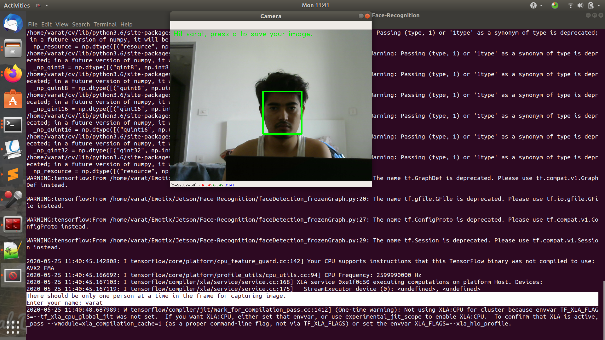
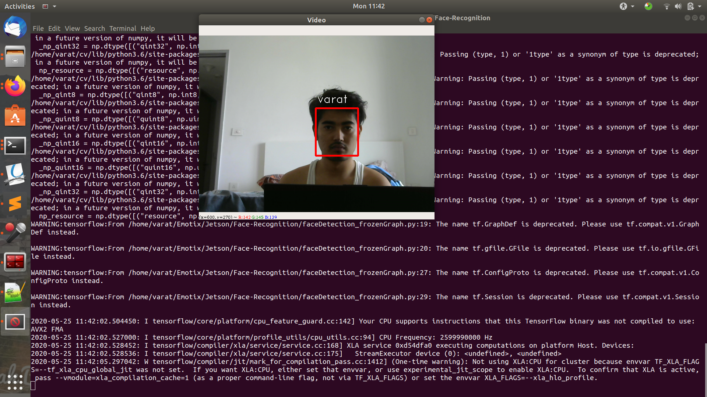

Here are two methods of face detection, 1) Haar Cascade and 2) CNN Face Detection. For Haar Cascade based face recognition we can run `face_recognition_haarcascade.py` whereas for CNN based face recognition you can run `face_recognition_webcam.py`.
### Usuage
There are two ways of adding people in to the known_persons directory.
1. run `add_persons.py` and enter your name and then take your photo from webcam
2. else, directly copy your photo with filename your-name.jpg into known_persons directory
3. Once your photos are saved into known_persons directory, you can run the script `face_recognition_webcam.py` for face recognition

### Results
1. After running `add_persons.py`

2. Face recongnition `face_recognition_webcam.py`

### References
1. Face detection inference part is modified version of https://github.com/yeephycho/tensorflow-face-detection
2. Face recognition part is mainly taken from https://github.com/ageitgey/face_recognition
